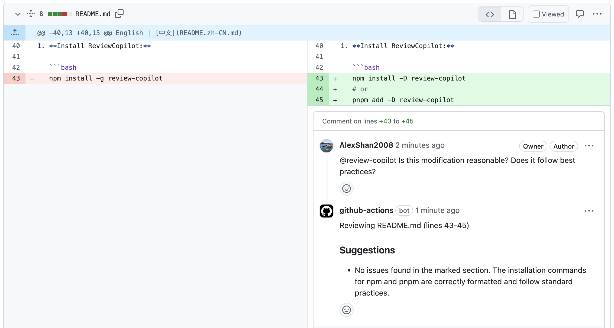
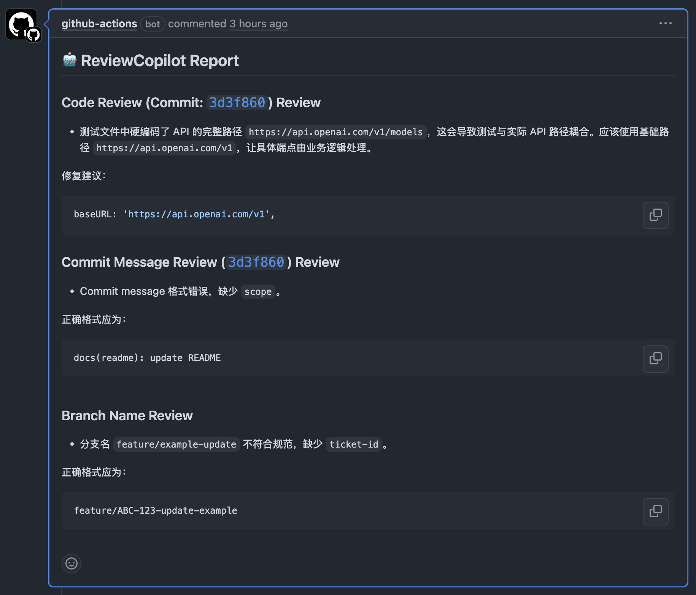

中文 | [English](README.md)

<p align="center">
  
</p>

<h1 align="center">ReviewCopilot</h1>

<p align="center">
  <strong>基于 AI 的 GitHub 代码审查助手，支持自定义规则和多提供商</strong>
</p>

<p align="center">
  <a href="https://github.com/AlexShan2008/review-copilot/actions"></a>
  <a href="https://codecov.io/gh/AlexShan2008/review-copilot"></a>
  <a href="https://www.npmjs.com/package/review-copilot"></a>
  <a href="https://www.npmjs.com/package/review-copilot"></a>
  <a href="https://opensource.org/license/MIT"></a>
  <a href="https://github.com/AlexShan2008/review-copilot/blob/main/CONTRIBUTING.md"></a>
</p>

---

## 📋 目录

- [✨ 功能特性](#-功能特性)
- [🚀 快速开始](#-快速开始)
- [📦 安装](#-安装)
- [⚙️ 配置](#️-配置)
- [🤖 AI 提供商](#-ai-提供商)
- [🔧 使用方法](#-使用方法)
- [🏗️ CI/CD 集成](#️-cicd-集成)
- [📚 示例](#-示例)
- [🖼️ 截图展示](#️-截图展示)
- [🐛 故障排除](#-故障排除)
- [🤝 贡献指南](#-贡献指南)
- [📄 许可证](#-许可证)

---

## ✨ 功能特性

<table>
<tr>
<td width="50%">

**🤖 AI 驱动审查**
- OpenAI GPT 模型支持
- DeepSeek 集成
- 自定义审查提示
- 多提供商支持

</td>
<td width="50%">

**📝 智能规则**
- 提交信息验证
- 分支命名规范
- 自定义审查点
- 文件模式过滤

</td>
</tr>
<tr>
<td width="50%">

**🔧 易于集成**
- GitHub Actions 就绪
- GitLab CI（即将推出）
- 基于环境的配置
- 零配置设置

</td>
<td width="50%">

**🎯 灵活安全**
- YAML 配置
- 环境变量
- Glob 模式过滤
- 安全的 API 密钥管理

</td>
</tr>
</table>

---

## 🚀 快速开始

2 分钟内快速启动 ReviewCopilot：

```bash
# 1. 安装
npm install -D review-copilot

# 2. 初始化
npx review-copilot init

# 3. 设置 API 密钥
echo "AI_API_KEY_DEEPSEEK=your-api-key" >> .env

# 4. 运行审查
npx review-copilot review
```

> **💡 提示**: 推荐使用 DeepSeek，稳定性更好。OpenAI 支持为测试版。

### 🎯 你将获得：
- ✅ 自动化代码质量分析
- ✅ 安全漏洞检测
- ✅ 性能优化建议
- ✅ 最佳实践执行
- ✅ 直接 PR 评论集成

### 💭 为什么选择 ReviewCopilot？

<table>
<tr>
<td width="50%">

**⏰ 节省时间**
- 代码变更即时反馈
- 减少 60% 的手动审查时间
- 专注架构，而非语法

</td>
<td width="50%">

**🔧 易于设置**
- 零配置即可使用
- 与现有 CI/CD 兼容
- 支持多个 AI 提供商

</td>
</tr>
<tr>
<td width="50%">

**📈 提升质量**
- 一致的审查标准
- 早期发现问题
- 从 AI 建议中学习

</td>
<td width="50%">

**💰 成本效益**
- 减少高级开发者审查时间
- DeepSeek：约 ¥0.007 每次请求
- OpenAI：约 ¥0.07 每次请求

</td>
</tr>
</table>

---

## 📦 安装

### 使用 npm
```bash
npm install -D review-copilot
```

### 使用 pnpm
```bash
pnpm add -D review-copilot
```

### 使用 yarn
```bash
yarn add -D review-copilot
```

---

## ⚙️ 配置

### 基础设置

运行 `npx review-copilot init` 后，你将获得一个 `.review-copilot.yaml` 文件：

```yaml
providers:
  deepseek:
    enabled: true
    apiKey: ${AI_API_KEY_DEEPSEEK}
    model: deepseek-chat

rules:
  commitMessage:
    enabled: true
    pattern: '^(feat|fix|docs|style|refactor|test|chore|ci)(\\(.+\\))?: .{1,50}'
  
  branchName:
    enabled: true
    pattern: '^(feature|bugfix|hotfix|release)/[A-Z]+-[0-9]+-.+'
  
  codeChanges:
    enabled: true
    filePatterns:
      - '**/*.{ts,tsx,js,jsx}'
      - '!**/dist/**'
      - '!**/node_modules/**'
```

### 环境变量

在项目根目录创建 `.env` 文件：

```env
# 选择你的 AI 提供商
AI_API_KEY_DEEPSEEK=your-deepseek-api-key
AI_API_KEY_OPENAI=your-openai-api-key
```

### 高级配置

<details>
<summary>📖 点击展开高级配置选项</summary>

```yaml
providers:
  openai:
    enabled: false
    apiKey: ${AI_API_KEY_OPENAI}
    model: gpt-4o-mini
    baseURL: https://api.openai.com/v1
  
  deepseek:
    enabled: true
    apiKey: ${AI_API_KEY_DEEPSEEK}
    model: deepseek-chat
    baseURL: https://api.deepseek.com/v1

customReviewPoints:
  - name: '安全检查'
    prompt: '审查代码中的潜在安全漏洞，重点关注输入验证、身份认证和数据处理。'
  
  - name: '性能评审'
    prompt: '分析代码的性能瓶颈、内存使用和优化机会。'
  
  - name: '可访问性检查'
    prompt: '审查前端代码的可访问性合规性和最佳实践。'

rules:
  commitMessage:
    enabled: true
    pattern: '^(feat|fix|docs|style|refactor|test|chore|ci)(\\(.+\\))?: .{1,50}'
    prompt: '确保提交消息遵循 Conventional Commits 规范。'
  
  branchName:
    enabled: true
    pattern: '^(feature|bugfix|hotfix|release)/[A-Z]+-[0-9]+-.+'
    prompt: '检查分支名是否符合模式：<type>/<ticket-id>-<description>'
  
  codeChanges:
    enabled: true
    filePatterns:
      - '**/*.{ts,tsx,js,jsx,py,java,go,rs}'
      - '!**/test/**'
      - '!**/tests/**' 
      - '!**/*.test.*'
      - '!**/*.spec.*'
      - '!**/dist/**'
      - '!**/build/**'
      - '!**/node_modules/**'
      - '!**/coverage/**'
    prompt: '审查代码变更，重点关注代码质量、潜在错误、性能、安全性和最佳实践。'
```

</details>

---

## 🤖 AI 提供商

### DeepSeek（推荐）
- ✅ 稳定可靠
- ✅ 性价比高
- ✅ 良好的代码理解能力
- 🔑 获取 API 密钥：[DeepSeek 平台](https://platform.deepseek.com/)

### OpenAI（测试版）
- ⚠️ 测试版支持
- ✅ 高质量审查
- ⚠️ 成本较高
- 🔑 获取 API 密钥：[OpenAI 平台](https://platform.openai.com/)

---

## 🔧 使用方法

### 命令行

```bash
# 审查当前分支变更
npx review-copilot review

# 审查特定拉取请求
npx review-copilot review --pr 123

# 初始化配置
npx review-copilot init

# 显示帮助
npx review-copilot --help
```

### 文件过滤

使用 glob 模式控制要审查的文件：

```yaml
filePatterns:
  # 包含模式
  - '**/*.{ts,tsx,js,jsx}'
  - '**/*.{py,java,go,rs}'
  
  # 排除模式
  - '!**/node_modules/**'
  - '!**/dist/**'
  - '!**/build/**'
  - '!**/*.test.*'
  - '!**/*.spec.*'
```

---

## 🏗️ CI/CD 集成

### GitHub Actions

创建 `.github/workflows/review.yml`：

```yaml
name: Code Review

on:
  pull_request:
    types: [opened, synchronize]
  issue_comment:
    types: [created]

jobs:
  review:
    runs-on: ubuntu-latest
    if: github.event_name == 'pull_request' || contains(github.event.comment.body, '@review-copilot')
    
    steps:
      - uses: actions/checkout@v4
        with:
          fetch-depth: 0
      
      - uses: actions/setup-node@v4
        with:
          node-version: '18'
      
      - run: npm install -g review-copilot
      
      - name: Run Review
        env:
          AI_API_KEY_DEEPSEEK: ${{ secrets.AI_API_KEY_DEEPSEEK }}
          GITHUB_TOKEN: ${{ secrets.GITHUB_TOKEN }}
        run: review-copilot review
```

### 仓库密钥

将 API 密钥添加到 GitHub 仓库密钥：
1. 前往 **Settings** → **Secrets and variables** → **Actions**
2. 点击 **New repository secret**
3. 名称：`AI_API_KEY_DEEPSEEK`
4. 值：你的 DeepSeek API 密钥

> **🔒 安全提示**: 绝不要将 API 密钥直接提交到仓库中。始终使用 GitHub Secrets 或环境变量。

---

## 📚 示例

### 手动触发审查

在任何拉取请求中评论 `@review-copilot` 来触发手动审查：



### 自动 PR 审查

ReviewCopilot 自动审查代码变更并发布详细反馈：



完整设置说明请查看我们的[示例目录](examples/README.zh-CN.md)。

---

## 🖼️ 截图展示

<details>
<summary>📸 点击查看更多截图</summary>

### 审查评论示例


### 手动触发示例  


### 真实示例
查看真实审查评论：[ReviewCopilot PR 审查示例](https://github.com/AlexShan2008/review-copilot/pull/25#issuecomment-2922197158)

</details>

---

## 🐛 故障排除

<details>
<summary>🔧 常见问题和解决方案</summary>

### API 密钥问题
```bash
# 错误：未找到 API 密钥
# 解决方案：检查你的 .env 文件
echo "AI_API_KEY_DEEPSEEK=your-key" >> .env
```

### GitHub Actions 权限
```yaml
# 如需要，添加到你的工作流
permissions:
  contents: read
  pull-requests: write
  issues: write
```

### 文件模式问题
```yaml
# 确保转义特殊字符
filePatterns:
  - '**/*.{ts,tsx}' # ✅ 正确
  - '**/*.{ts,tsx}' # ❌ 不带引号可能会有问题
```

### 常见错误消息

| 错误 | 解决方案 |
|-------|----------|
| `No changes detected` | 确保你在有变更的 git 仓库中 |
| `API key not found` | 检查你的 `.env` 文件和环境变量 |
| `Rate limit exceeded` | 稍等片刻重试，或升级你的 API 计划 |
| `File pattern error` | 验证配置中的 glob 模式 |

</details>

---

## 🤝 贡献指南

我们欢迎贡献！以下是你可以帮助的方式：

### 开发设置
```bash
# 克隆仓库
git clone https://github.com/AlexShan2008/review-copilot.git
cd review-copilot

# 安装依赖
pnpm install

# 运行测试
pnpm test

# 构建项目
pnpm build
```

### 贡献方式
- 🐛 **报告错误** 通过开启 issue
- ✨ **建议功能** 或改进
- 📖 **改进文档**
- 🔧 **提交拉取请求**
- 🧪 **添加测试用例**

请阅读我们的[贡献指南](CONTRIBUTING.md)了解详细指导。

---

## 📊 项目状态

> **当前状态**
> - ✅ **GitHub 集成**：完全支持
> - 🚧 **GitLab 集成**：开发中
> - ✅ **DeepSeek 提供商**：稳定
> - ⚠️ **OpenAI 提供商**：测试版（欢迎 PR！）

## 🌟 社区与支持

<div align="center">

[](https://github.com/AlexShan2008/review-copilot/stargazers)
[](https://github.com/AlexShan2008/review-copilot/network/members)
[](https://github.com/AlexShan2008/review-copilot/issues)

</div>

### 📞 获取帮助
- 📋 **文档**：查看我们的[示例](examples/README.zh-CN.md)
- 🐛 **错误报告**：[开启 issue](https://github.com/AlexShan2008/review-copilot/issues/new?template=bug_report.md)
- 💡 **功能请求**：[请求功能](https://github.com/AlexShan2008/review-copilot/issues/new?template=feature_request.md)
- 💬 **问题咨询**：[在 Issues 中提问](https://github.com/AlexShan2008/review-copilot/issues)

---

## 📄 许可证

本项目采用 MIT 许可证 - 查看 [LICENSE](LICENSE) 文件了解详情。

---

<p align="center">
  <strong>由 ReviewCopilot 团队用 ❤️ 制作</strong>
</p>

<p align="center">
  <a href="https://github.com/AlexShan2008/review-copilot/issues">报告错误</a> •
  <a href="https://github.com/AlexShan2008/review-copilot/issues">请求功能</a> •
  <a href="https://github.com/AlexShan2008/review-copilot">⭐ 给我们点星</a>
</p>
