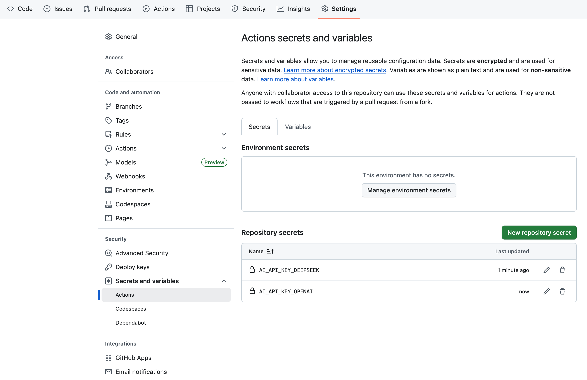

English | [中文](README.zh-CN.md)

# Examples

## GitHub

### GitHub Actions

Create a `.github` directory in your project root, then a `workflows` directory inside it. Add a `review.yml` file under `workflows`. See: [examples/github/.github/workflows/review.yml](.github/workflows/review.yml)

### Configure GitHub Actions secrets and variables

In your GitHub project, go to `Settings` -> `Secrets and variables` -> `Actions`, then click `New repository secret` to add `AI_API_KEY_OPENAI` and `AI_API_KEY_DEEPSEEK`.



### Install ReviewCopilot in your project

```bash
pnpm add -D review-copilot
```

### Check ReviewCopilot installation

```bash
npx review-copilot --version
0.4.0
```

### Initialize ReviewCopilot

```bash
npx review-copilot init
```

### Run ReviewCopilot

```bash
npx review-copilot review
```

### Configure review copilot workflow

Create `.github/workflows/review.yml` in your project root. Example:

```yaml
# See the main documentation for workflow configuration details
```
