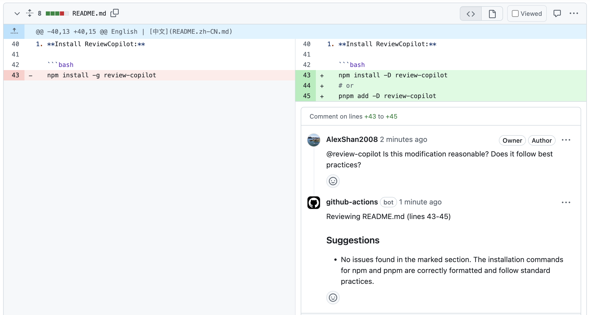

<p align="center">
  
</p>

中文 | [English](README.md)

# 示例：GitHub Actions 集成

本指南演示如何在 GitHub 仓库中通过 GitHub Actions 配置 **ReviewCopilot** 实现自动化代码审查。

---

## 前置条件

- 一个 GitHub 仓库（新建或已有均可）
- 本地已安装 Node.js 和 npm（或 pnpm/yarn）
- 已获取 OpenAI 或 DeepSeek 的 API 密钥

---

## 步骤详解

### 1. 安装 ReviewCopilot

```bash
npm install -D review-copilot
# 或
pnpm add -D review-copilot
```

### 2. 初始化配置

```bash
npx review-copilot init
```

将在项目根目录生成 `.review-copilot.yaml` 配置文件。

### 3. 添加 API 密钥到 GitHub Secrets

1. 打开你的 GitHub 仓库
2. 进入 **Settings** → **Secrets and variables** → **Actions**
3. 点击 **New repository secret**，添加：
   - `AI_API_KEY_OPENAI`（用于 OpenAI）
   - 或 `AI_API_KEY_DEEPSEEK`（用于 DeepSeek）


### 4. 添加 GitHub Actions 工作流

在项目根目录创建 `.github/workflows/review.yml` 文件，内容如下：

```yaml
name: ReviewCopilot Code Review

on:
  pull_request:
    types: [opened, synchronize]
  pull_request_review_comment:
    types: [created]

jobs:
  review:
    runs-on: ubuntu-latest
    steps:
      - uses: actions/checkout@v4
      - name: Set up Node.js
        uses: actions/setup-node@v4
        with:
          node-version: '20'
      - name: Install dependencies
        run: npm install
      - name: Run ReviewCopilot
        env:
          AI_API_KEY_OPENAI: ${{ secrets.AI_API_KEY_OPENAI }}
          AI_API_KEY_DEEPSEEK: ${{ secrets.AI_API_KEY_DEEPSEEK }}
        run: npx review-copilot review
```

> **提示：** 根据你的包管理器或 CI 设置调整工作流配置。

### 5. （可选）自定义 `.review-copilot.yaml`

编辑 `.review-copilot.yaml` 以匹配你的审查需求。例如，你可以指定要审查的文件、设置提交信息规则或添加自定义审查点。详情请参见[主配置示例](../.review-copilot.yaml)。

### 6. 测试集成

- 在仓库中手动创建一个 Pull Request。如果你使用 `github-script` 自动创建 PR，请参考 [auto-pr 示例](../.github/workflows/auto-pr.yml)。

- ReviewCopilot 将自动运行并在发现问题时发布审查评论。

- 要手动启动代码审查，只需在 Pull Request 的任何评论中 `@review-copilot`。

**注意：** 当使用仓库的 `GITHUB_TOKEN` 执行任务时，除了 `workflow_dispatch` 和 `repository_dispatch` 之外，由该令牌触发的事件**不会**触发新的工作流运行。这是为了防止意外的递归执行。

更多详情，请参见 [GitHub 文档](https://docs.github.com/en/actions/security-for-github-actions/security-guides/automatic-token-authentication#using-the-github_token-in-a-workflow)。

---

## 预期效果

- 每次 PR 时，GitHub Actions 自动运行 ReviewCopilot
- 审查结果会以评论形式反馈在 PR 页面

---

## 实际审查效果

以下为 ReviewCopilot 在 Pull Request 上自动生成的审查评论示例：




查看真实 PR 评论：[ReviewCopilot PR 审查示例](https://github.com/AlexShan2008/review-copilot/pull/25#issuecomment-2922197158)

---

## 常见问题

- **没有审查评论？**  
  检查 API 密钥是否有效，Secrets 是否正确设置
- **工作流失败？**  
  确认 Node.js 及依赖已安装，YAML 配置无误
- **需要更多帮助？**  
  参见 [主文档](../README.zh-CN.md) 或提交 issue

---

## 更多

- [主文档](../README.zh-CN.md)
- [配置参考](../.review-copilot.yaml)
